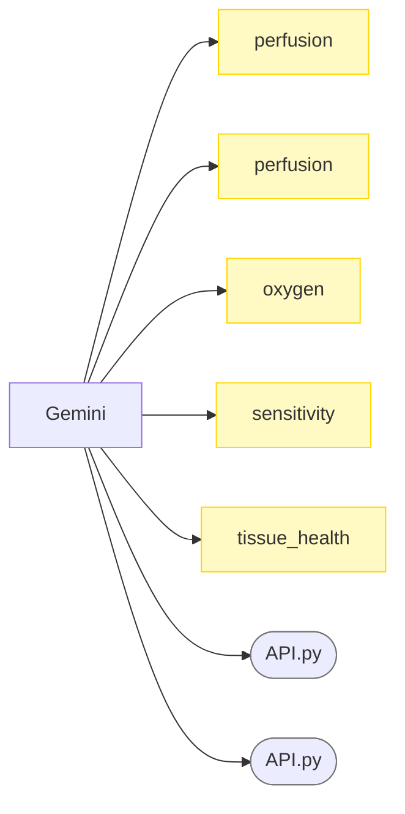

# Chart

## Overview

<!--
https://www.mermaidchart.com/play#pako:eNqNjlFLwzAQx79KiDAcuLEurcv6IIpSEXwQX41sXb3aYExKk22W0e_uBWlhs4PmXnK_-3H_O9DMfACNaa7MPivSypHnV6EJPr0I3gR9hG-ppaDvZDK5QTZHVkKVb6002uMRQobQ_NSf0JEQiQVtpZM76eoWR7cHotINqJgI6qS1W1ivCkiVKwQljXd4XwIPLpHevTxNS79r3F34dxVnp-NWmGOgLdISYlJB5pqWszM8PMOjfs7791tXK_Dp-KvMF8QXSfJwPZtd5VIp3yTL-_BYZcPVcLgaDVb58Ft50KmLyNfxlP2b-qLNL1lYu_0
-->
